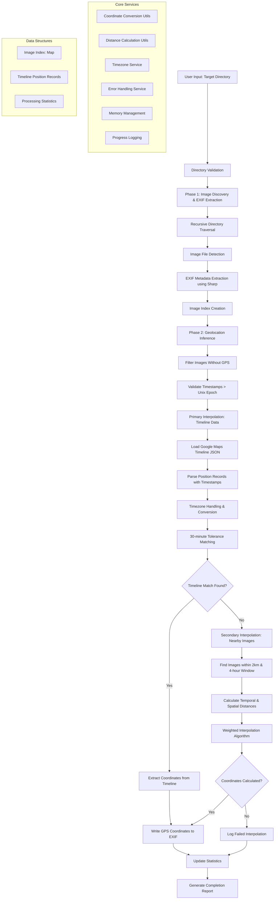

# Image Geolocation Processing System Architecture

## System Overview

This Node.js application processes image geolocation using Google Maps timeline data and temporal interpolation through a two-phase processing system.

## Architecture Diagram

## Key Components

### Phase 1: Image Discovery & EXIF Extraction
- **Directory Traversal**: Recursive scanning for image files
- **Format Support**: JPEG, TIFF, PNG, RAW formats via Sharp library
- **Metadata Extraction**: Complete EXIF data extraction and indexing
- **Memory Management**: Efficient handling of large image collections

### Phase 2: Geolocation Inference
- **Primary Method**: Google Maps timeline interpolation with 30-minute tolerance
- **Secondary Method**: Nearby image interpolation within 2km radius and 4-hour window
- **Weighted Algorithm**: Temporal and spatial distance-based coordinate calculation

### Core Services
- **Coordinate Conversion**: E7 format to decimal degrees conversion
- **Distance Calculations**: Haversine formula for spatial proximity
- **Timezone Handling**: EXIF timezone extraction with system fallback
- **Error Handling**: Comprehensive I/O and parsing error management

## Data Flow

1. **Input Validation**: Verify target directory exists and is accessible
2. **Image Indexing**: Create comprehensive metadata index of all images
3. **Timeline Processing**: Parse Google Maps data and extract position records
4. **Interpolation Logic**: Apply dual fallback mechanism for coordinate inference
5. **EXIF Writing**: Inject calculated GPS coordinates back to image files
6. **Statistics Reporting**: Generate detailed completion statistics

## Technical Specifications

- **Language**: Modern JavaScript with ES modules
- **Dependencies**: Sharp (image processing), readline-sync (user input)
- **Architecture**: Modular service-oriented design
- **Error Handling**: Comprehensive try-catch with detailed logging
- **Performance**: Memory-efficient processing for large image collections
- **Validation**: Unix epoch timestamp and coordinate bounds checking
